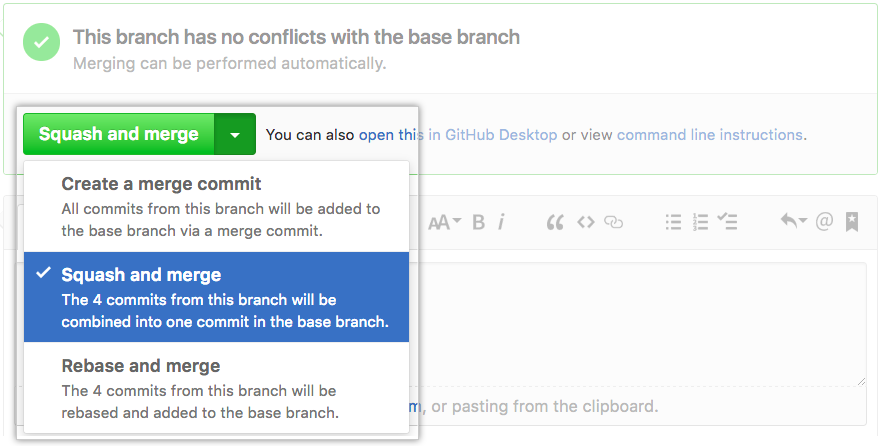
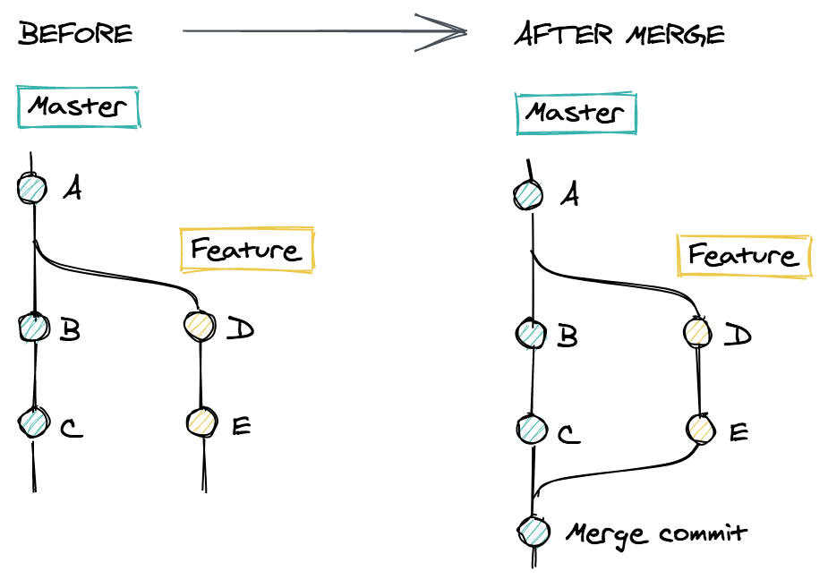
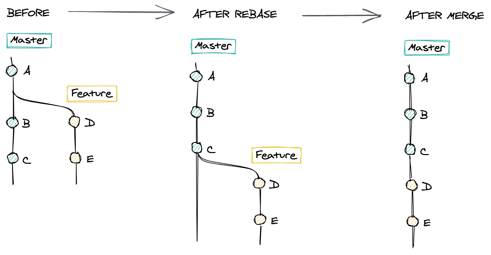
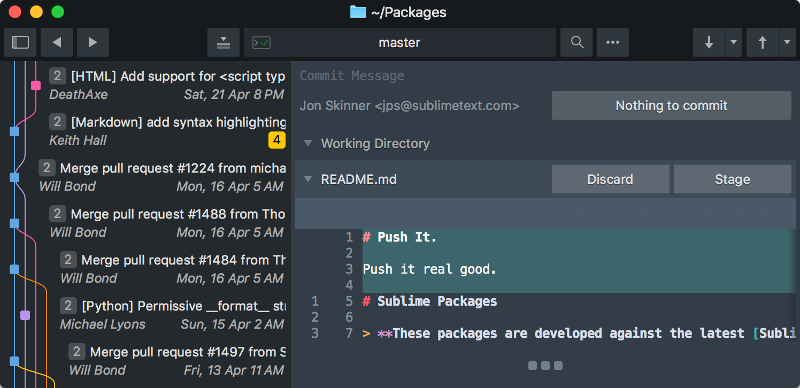

Your project's Git history is a powerful time machine. Here's how to avoid flooding it with useless noise.

## Squash your commits

I like committing my changes frequently. It makes me feel safe knowing my changes are saved somewhere, so I commit every time I take a small break. But that means my commits become meaningless. They reflect what my days look like, not what's in my code.

Some changes only make sense when grouped together. But they end up spread out across commits like this:

<Image src="/assets/redundant-commits.png" alt="Redundant commits" />

It's hard giving each one a meaningful name, because they have no individual value. They're just here to let me go back in time if I mess up too much. And that's fine – as long as they don't stay around forever.

To clean up a bunch of redundant commits, you can squash them. That means combining them into a single commit that contains all of their changes. Suddenly your history becomes neat and relevant.


You can squash the commits using the CLI, but the syntax is quite fuzzy ([from Stack Overflow](http://stackoverflow.com/a/5201642/295797)):

```shell
# Squashes the last 3 commits
git reset --soft HEAD~3 && git commit
```

The most convenient way to squash commits is during Pull Requests. Both GitHub and GitLab let you combine your commits when you decide to merge your branch.

Using GitHub : 

Using GitLab :

## Rebase before merging

When we're coding a new feature, it's a good practice to work on a separate branch – often called a _feature branch_. But by the time our feature is ready, new commits have probably been added to the master branch.

This means Git won't be able to perform a *fast-forward* merge. Instead, it will have to create a merge commit to reconcile the history of the two branches.



This adds quite a lot of complexity to our history. We get a new weird, auto-generated commit, and our tree becomes two-dimensional, making it hard to read.

Ideally, we would have waited for the commits `B` and `C` from our diagram before making our own branch. This would be a terrible workflow, preventing us from working in parallel with our colleagues. But we can simulate this scenario with a simple command.

```shell
# from the feature branch
git rebase origin/master
```

Rebase modifies the history of our branch. It re-applies all of our changes on top of the latest version of `master`.



After rebasing, when we run `git merge master`, Git is able to do a fast-forward merge. Now we have a neat, linear and readable Git history. If you're using GitHub pull requests, you can use "Rebase and merge" to make this process automatic.

## Stash your unfinished changes

Sometimes I start making changes in my code before realizing that I'm in the wrong branch. The trap would be to checkout to that branch immediately – then our uncommitted changes would be [lost](https://stackoverflow.com/questions/2961240/get-back-the-changes-after-accidental-checkout)! We could also commit these changes before running `git checkout`, but we would end up having an unwanted commit in the wrong branch.

Git has the perfect command for that use case: `git stash`. Stashing clears all the changes we've made since our last commit. This gives us a clean state that allows us to update our context, whether we want to switch branches or pull changes. But the changes aren't lost, they are saved in invisible storage. We can think of it as a glorified clipboard, able to store changes across many files.

Then, we just type `git stash pop`, and our changes are restored.

## Amend your last commit

It's usually right after making a commit that our mistakes stand out. Maybe it's a typo, a forgotten console log, or useless commented code. Either way, it's silly can be fixed by a one-line commit.

But then our history feels wrong. It puts our original commit, which may represent a full day of work, on the same level as our tiny hotfix. We're also exposing our mistake to everyone on the project, which sucks.

To avoid this, we can instead modify the history, and add our fix to the last commit. After staging our changes, run this command:

```shell
git commit --amend --no-edit
```

And *voilà*, we sneakily corrected our mistake. Note that if we already pushed our last commit, we would have to force push our amendment. This is fine if we're working on our own branch, but we should avoid doing it on `master`.

## Visualize your Git tree

When we work with several people on multiple branches, it's easy to get lost. We then make mistakes because we don't have a good understanding of how we got there. To avoid this, we can display a visualization of our Git history. We can do this using the Git CLI:

```shell
git log --graph --oneline --all
```

If we want more comprehensive visual feedback, we can use a Git GUI. For example, here's what Sublime Merge would look like:



We can perform all Git commands using the CLI, but sometimes using an app makes more sense. Some complex actions – like interactive rebases, cherry-picking, or managing stashes – are hard to grasp using only the command line. Having a GUI helps us make less mistakes.

I hope this was helpful. If you want to improve your mental model of advanced Git commands, I recommend reading [Lydia Hallie's article](https://dev.to/lydiahallie/cs-visualized-useful-git-commands-37p1). Let me know if you have more tips to share, and happy coding!
