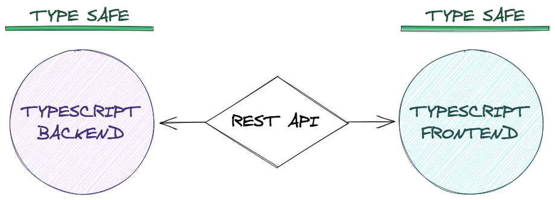
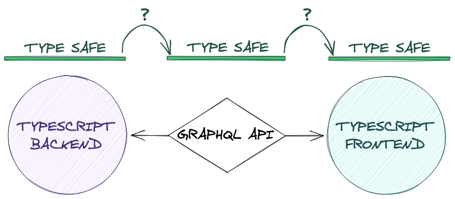
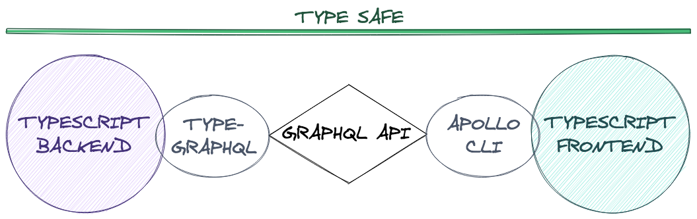

In the JavaScript community, static types often get bad press. Maybe because it gives a false sense of confidence, or because configuring the right tools is hard. Both are frequent issues, and happen because of mistakes in our app's architecture. Let's try to fix this.

## The problem

Consider this codebase written in TypeScript:



We never even use the `any` type. It should be type-safe, right? Well, no, at least not yet.

The problem is that our type safety is only as strong as its weakest point. In our case, the loose end is our API. The types from the frontend and the backend both live on their separate world. So we write types on the frontend based on what we _assume_ the backend will send, and vice versa.

We have multiple sources of truth, and no guarantee that they will keep in sync. It's already annoying for our project. But it can become a huge issue if we have an architecture based on many microservices.

## GraphQL to the rescue

Unlike Rest, GraphQL has a type system in its [core principles](https://graphql.org/learn/schema/). We can use it to make type-safe API calls. The goal is to use it to propagate our backend types to the frontend.

But we have to make sure there are no holes in our type safety. On both the frontend and the backend, we need a way to convert port the GraphQL schema to TypeScript types. Here's the outline of the architecture:



In our case, we have 3 islands of type safety, but they're not connected to each other. To share our models from one end to the other, we need to build bridges on both sides.

## The frontend bridge

Our frontend has access to the GraphQL schema. We need a tool that will [introspect](https://graphql.org/learn/introspection/) it, and map the types to TypeScript. Then we can use the TS types like we normally would.

Apollo built a CLI with [this very feature](https://github.com/apollographql/apollo-tooling#apollo-clientcodegen-output). To help Apollo find your schema, you will first need to [create an `apollo.config.js` file](https://www.apollographql.com/docs/devtools/apollo-config/). But the CLI itself also provides many options. After some tweaking, here is the script I added to my last project's `package.json`:

```json
"scripts": {
  "apollo:types": "rm -rf src/__generated__ && apollo client:codegen --config apollo.config.js --target typescript --outputFlat src/__generated__"
}
```

We can then type `npm run apollo:types` when there's a change in our schema or our queries and mutations. We can also keep it running in the background like this: `npm run apollo:types --watch`

Note that the Apollo CLI can also be replaced by other tools:

* [GraphQL Code Generator](https://graphql-code-generator.com/) generates queries with the types already built-in
* [gqless](https://gqless.dev/) provides TypeScript types, and only requires code generation when our schema changes

We have now fixed half of the problem. Let's see the other side!

## The backend bridge

The next challenge is to make sure our GraphQL schema is tightly linked to our backend application code, which includes the resolvers and all the business logic. The way we do this depends on our strategy to generate the schema: SDL-first or code-first.

### SDL-first

If we write our GraphQL schema by hand, then just like for the frontend, we will need to set up code generation. This is why Prisma built [`graphqlgen`](https://github.com/prisma-labs/graphqlgen). It will make sure that our resolvers map one-to-one with our schema.

### Code-first

Code-first GraphQL development is also a good strategy. The process is reversed, you first write your types by hand in TypeScript, and they are then used to generate a GraphQL schema.

Once again, several [other](https://github.com/graphql/graphql-js) [tools](https://nexus.js.org/) exist to create code-first GraphQL schemas in Node. But I'll only show the one I have used and loved, [TypeGraphQL](https://typegraphql.com/). It uses [decorators](https://www.typescriptlang.org/docs/handbook/decorators.html) to extract a GraphQL schema from your TypeScript classes.

```ts
import { ObjectType, Field, ID, registerEnumType, Authorized } from 'type-graphql'

@ObjectType()
class User {
  @Field()
  email: string;
  
  @Field(type => [Rate])
  ratings: Rate[];

  @Field(type => Float, { nullable: true })
  get averageRating() {
    const sum = this.ratings.reduce((a, b) => a + b, 0);
    return sum / this.ratings.length;
  }
}
```

Not everyone loves decorators. They're still called an _experimental_ TypeScript feature, and you can see there are a few odd details in the syntax. But what they enable is huge. There's no script running in the background, we write TypeScript types like we're used to – but now we have a GraphQL schema.

This aproach is powerful because it's extensible by design. We can use it hand in hand with a decorator-based ORM, like [TypeORM](https://github.com/typeorm/typeorm) or [Typegoose](https://github.com/typegoose/typegoose). See what that looks like:

```ts
import { Entity, PrimaryGeneratedColumn, Column } from 'typeorm';
import { ObjectType, Field, ID, registerEnumType, Authorized } from 'type-graphql'

@Entity()
@ObjectType()
class User {
  // Available on both database and schema
  @PrimaryGeneratedColumn()
  @Field(type => ID)
  id: number;
  
  // Available on both database and schema
  @Column({ unique: true })
  @Field()
  email: string;

  // Available on database but NOT on schema
  @Column()
  passwordHash: string;
  
  // Available on both database and schema
  @OneToMany(type => Rate, rate => rate.author)
  @Field(type => [Rate])
  ratings: Rate[];

  // Available on schema but NOT database
  @Field(type => Float, { nullable: true })
  get averageRating() {
    const sum = this.ratings.reduce((a, b) => a + b, 0);
    return sum / this.ratings.length;
  }
}
```

We have now colocated the types required by TypeScript, our database and GraphQL in a single class. To remove a field from GraphQL, or add it to our database, we add or remove a decorator. It's [still not 100% type-safe yet](https://github.com/MichalLytek/type-graphql/issues/296), but we greatly reduce the risk of making mistakes by having all the type information grouped together.

## Conclusion

Let's see the architecture we ended up with:



I hope you get to love all the benefits that type safety brings. It improves the developer experience by making our tooling smarter. We get autocomplete in our IDE, and linters warn us when we write bugs. Most importantly, just like a good test suite, it gives us more confidence that our code is solid. Enjoy!
