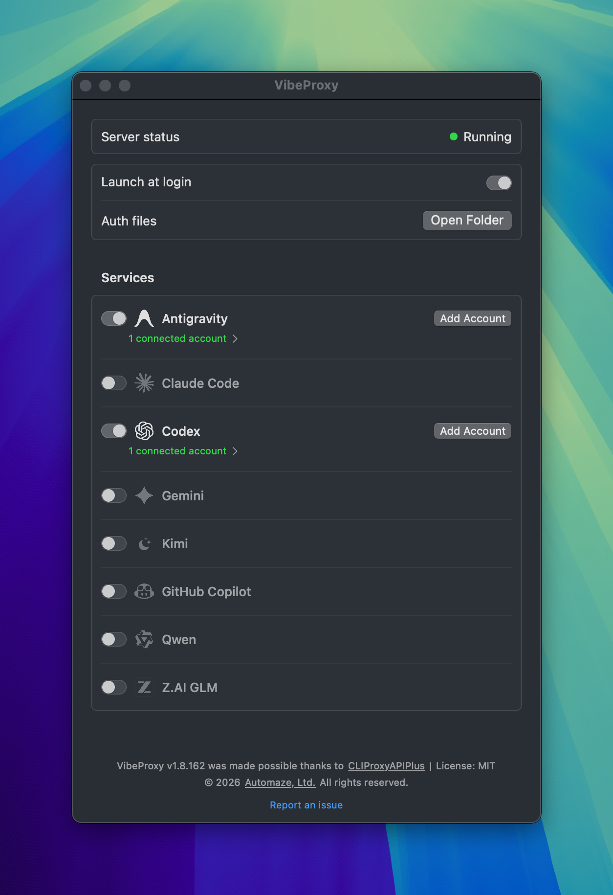
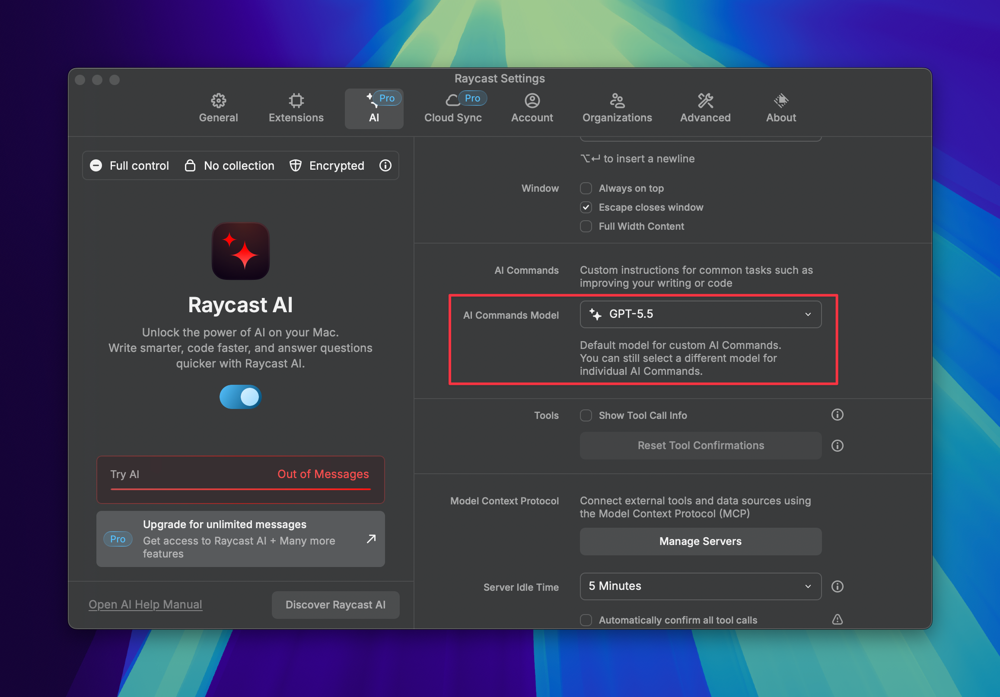

import Callout from "../../../components/Callout.astro";
import demoVideo from "./demo.mp4";

Raycast might be the best macOS app, and its AI Chat feature is my favorite way to chat with AI on my computer. But the free inference quota is quite limited, and I personally can't justify the Pro subscription for my usage. And while Raycast supports BYOK for AI, it feels off considering I'm already paying for AI subscriptions elsewhere.

So I put together a setup that lets me use these models without extra subscriptions:
- GPT models, using my $20/month Codex sub
- Claude models, using my Claude Pro sub
- Gemini models, without an AI plan, as Google gives you a fair amount for free. I currently have Flash as my default as I really enjoy its speed for simple chats.

Here's how to set it up.

<Callout variant="warning" title="Disclaimer">
  Using VibeProxy may violate the terms of use of your subscription providers.
</Callout>

## Installing Vibeproxy

What powers this trick is [VibeProxy](https://github.com/automazeio/vibeproxy). It's a macOS app that lets you log in to various AI providers that offer subscriptions (Claude, Codex, Copilot, Antigravity...). Then it exposes those subscriptions as standard OpenAI-compatible API endpoints, so you can use them for all sorts of inference needs, not just within coding agents.



The heavy lifting is done under the hood by [CLI Proxy API](https://github.com/router-for-me/CLIProxyAPI). VibeProxy is just a UI that controls it, but a really nice one. It's native, doesn't hog a terminal window, can start when you boot your Mac, and lets you see clearly what services are connected and running.

See [its releases page](https://github.com/automazeio/vibeproxy/releases) for installation.

## Configuring custom Raycast models

Now let's set up Raycast to use the APIs exposed by VibeProxy. Configuration is done in a YAML file, not in the settings UI. You'll find two relevant files on your system:

- `~/.config/raycast/ai/providers.template.yaml`: a file to show you dummy examples of how models can be registered
- `~/.config/raycast/ai/providers.yaml`: the actual file you should edit to add your models

The exact contents of the file depends on what models you want. Here's my own config, set up for Codex, Claude and Gemini. You can use it as a reference, along with the template file, to ask a coding agent to generate exactly the config you need.

```yaml
providers:
  - id: vibeproxy
    name: VibeProxy
    base_url: http://localhost:8317/v1
    api_keys:
      default: dummy-not-used
    models:
      - id: gpt-5.5
        name: "GPT-5.5"
        provider: default
        context: 272000
        abilities:
          temperature:
            supported: true
          vision:
            supported: true
          system_message:
            supported: true
          tools:
            supported: true
          reasoning_effort:
            supported: true
      - id: gemini-3.5-flash-low
        name: "Gemini 3.5 Flash"
        provider: default
        context: 1000000
        abilities:
          temperature:
            supported: true
          vision:
            supported: true
          system_message:
            supported: true
          tools:
            supported: true
          reasoning_effort:
            supported: true
      - id: claude-opus-4-5-20251101
        name: "CC: Opus 4.5"
        provider: default
        context: 200000
        abilities:
          temperature:
            supported: true
          vision:
            supported: true
          system_message:
            supported: true
          tools:
            supported: true
```

## Using it

Now in Raycast, if you use the AI Chat command and open the model picker, you'll see your custom models appear. You can distinguish them from the Raycast Pro ones thanks to the "VibeProxy" provider next to the model name.

<video controls>
  <source src={demoVideo} type="video/mp4" />
</video>

Finally, you'll want to set up a VibeProxy model as the default for all other AI commands. Look for the "AI Commands Model" picker in the Raycast settings AI tab.



That should have you covered!

Of course, you should also consider buying the Raycast Pro plan. It doesn't require any such configuration, offers many other perks, and more importantly, supports the company behind Raycast.
